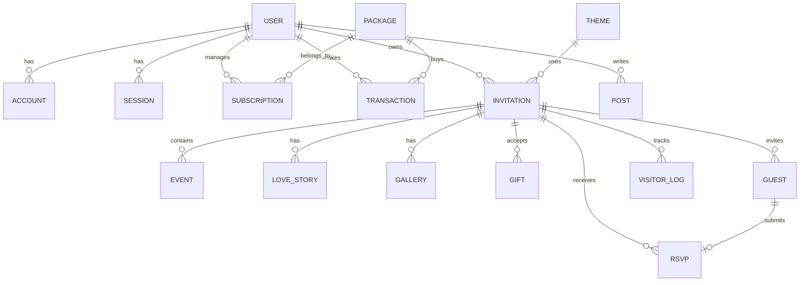

# Project Requirements Document (PRD)

**Document Version** : 2.0 (Brand Identity Integrated)
**Project Name**     : IKARA — Digital Storytelling Platform for Love & Celebration
**Tagline**          : Every Promise Has a Story
**Author**           : Asep Sutrisna Suhada Putra

---

## 1. Project Description

**IKARA** (*terinspirasi dari gabungan konsep Ikrar + Aksara*) merupakan sebuah platform digital modern untuk mengabadikan dan membagikan kisah cinta serta janji pernikahan melalui pengalaman yang indah, personal, dan bermakna.

Bukan sekadar website pembuat undangan statis, IKARA diposisikan sebagai **Digital Storytelling Platform for Love & Celebration**. Platform ini menyediakan template undangan *Modern Editorial Romance*, sistem RSVP real-time, galeri momen, audio latar, amplop digital, hingga dashboard analitik.

Project ini dikembangkan menggunakan arsitektur modern yang mengutamakan:

- Scalability
- Maintainability
- Reusability
- Modular Clean Architecture
- Best Practice & Modern Editorial Aesthetics

---

## 2. Vision

> **"To become the most meaningful digital platform for celebrating life's most important promises."**
> 

Membantu setiap pasangan membagikan kisah dan janji terpenting dalam hidup mereka dengan cara yang indah dan bermakna, yang dapat berkembang melingkupi perayaan momen penting kehidupan (Pernikahan, Tunangan, Anniversary, & Celebration).

---

## 3. Goals

Project memiliki tujuan sebagai berikut:

### Short Term (MVP - Minimum Viable Product)

- [ ]  Membuat MVP
- [ ]  Dashboard User
- [ ]  Template Dasar
- [ ]  RSVP System
- [ ]  Gallery
- [ ]  Payment Integration (Amplop Digital / Subscription)

### Mid Term

- [ ]  Multi Theme
- [ ]  Admin CMS
- [ ]  Premium Package
- [ ]  Analytics (Viewers, RSVP stats)
- [ ]  SEO Optimization

### Long Term

- [ ]  Mobile App
- [ ]  White Label
- [ ]  Custom Domain (contoh: rani-dan-budi.com)
- [ ]  QR Check-in Event
- [ ]  WhatsApp Automation (Blast Undangan, Reminder)
- [ ]  Email Automation
- [ ]  AI Assistant (Membantu membuat kata-kata undangan/balasan)

---

## 4. Target User & User Role

### Target User

- Pasangan yang akan menikah
- Wedding Organizer
- Event Organizer
- Freelancer
- Studio Foto

### User Role

`Guest` ➔ `User` ➔ `Admin` ➔ `Super Admin`

---

## 5. User Flow & Business Model

### Editing Strategy

**Hybrid (Form-Based Self-Service):** *User* mengedit datanya sendiri secara mandiri 24 jam penuh melalui pengisian *Form Input* (*React Hook Form*) di *Dashboard*. Layout dan struktur desain undangan mutlak diatur oleh kode sistem (*Theme*) untuk menjamin kualitas visual tetap premium (*scalable* & mencegah kerusakan desain oleh *user* awam).

### Payment & Subscription Concept (via Midtrans)

Sistem monetisasi menggunakan dua jalur (*Dual-Revenue Stream*):

- **B2C (Calon Pengantin):** *Freemium One-Time Payment*. User bisa membuat undangan gratis dengan fitur terbatas (*watermark* aktif). Membayar satu kali (contoh: masa aktif 6-12 bulan) untuk *unlock* tema eksklusif dan menghilangkan *watermark*.
- **B2B (Wedding Organizer / Studio):** *Recurring Subscription / Credit System*. WO berlangganan bulanan/tahunan untuk mendapatkan kuota pembuatan undangan klien (otomatis premium).

### Application Flow

`Landing Page (SaaS Info & Demo)` ➔ `Register` ➔ `Dashboard` ➔ `Choose Theme` ➔ `Create Invitation (Isi Data di Form)` ➔ `Subscription (Unlock Fitur Premium)` ➔ `Publish` ➔ `Share Link` ➔ `Guest Open Invitation` ➔ `RSVP`

---

## 6. Tech Stack

| Kategori | Teknologi | Tujuan / Fungsi |
| --- | --- | --- |
| **Frontend** | Next.js | Fullstack Framework |
|  | React | UI Library |
|  | JavaScript | Programming Language |
|  | Tailwind CSS | Styling |
|  | shadcn/ui | UI Components |
|  | Framer Motion | UI Animation |
|  | GSAP | Landing Animation |
| **Backend** | Next.js Route Handler | REST API |
|  | Server Actions | Server Logic |
|  | Prisma Client Edge | Database ORM (Edge Compatible) |
|  | PostgreSQL | Database |
| **Services** | Auth.js | Authentication |
|  | Cloudflare R2 | Storage (Image, Audio, etc) |
|  | Resend | Email Service |
|  | Midtrans | Payment Gateway |
|  | Leaflet | Maps |
| **Deployment** | Cloudflare Pages | App Hosting (via next-on-pages) |
|  | Neon PostgreSQL | Database Hosting (HTTP Driver) |
| **Utility** | React Hook Form, Axios, Zustand | State & Fetching Management |
|  | ESLint, Prettier, Git, GitHub | Linter & Version Control |

**Alasan Memilih Stack Ini:**
JavaScript Fullstack, mudah dipelajari, cepat dikembangkan, siap untuk skala besar, tidak perlu migrasi framework, komunitas besar, dan sangat cocok untuk *solo developer*.

---

## 7. Architecture

### Architecture Style

**Modular Clean Architecture** yang menggabungkan:

- Feature-Based Architecture
- Layered Architecture
- Repository Pattern
- Service Pattern
- Separation of Concerns

### Layers

`Presentation Layer` ➔ `Business Layer` ➔ `Repository Layer` ➔ `Database Layer`

### Data Flow

`Browser` ➔ `Page` ➔ `Feature` ➔ `Action` ➔ `Service` ➔ `Repository` ➔ `Prisma` ➔ `PostgreSQL`

### External Service Integration

Aplikasi Next.js terhubung sebagai pusat ke: `PostgreSQL`, `Auth.js`, `Midtrans`, `Cloudflare R2`, `Resend`, dan `Leaflet`.

### Architecture Principles

✔ SOLID
✔ DRY
✔ KISS
✔ Clean Code
✔ Separation of Concerns
✔ Feature First
✔ Reusable Component

---

## 8. Folder Structure

> **Arsitektur:** Feature-First + Layered Clean Architecture
**Prinsip:** `app/` hanya untuk routing. Logic ada di `features/` dan `server/`.
> 

### Root Directory

```
saas-invitationcard/
│
├── prisma/                         # ORM Schema & Migrations
│   ├── schema.prisma
│   ├── migrations/
│   └── seed.js
│
├── public/                         # Static assets
│
├── src/
│   │
│   ├── app/                        # Next.js App Router (Folder Rute Standar Tanpa Kurung)
│   │   ├── page.jsx                # Landing Page publik IKARA (URL: /)
│   │   ├── login/
│   │   │   ├── page.jsx            # Halaman Login (URL: /login)
│   │   │   └── layout.jsx
│   │   ├── register/
│   │   │   ├── page.jsx            # Halaman Register (URL: /register)
│   │   │   └── layout.jsx
│   │   │
│   │   ├── dashboard/              # Folder rute Dashboard utama (URL: /dashboard)
│   │   │   ├── page.jsx            # Dashboard Overview & Kartu Undangan Aktif
│   │   │   ├── analytics/page.jsx  # Analitik Undangan & Metrik
│   │   │   ├── themes/page.jsx     # Galeri Koleksi Tema
│   │   │   ├── invitations/
│   │   │   │   └── new/page.jsx    # Editor Multi-Step Form Undangan Baru
│   │   │   ├── subscription/page.jsx
│   │   │   ├── settings/page.jsx
│   │   │   └── layout.jsx          # Protected Dashboard Layout Wrapper (Sidebar + Header)
│   │   │
│   │   ├── [slug]/page.jsx         # Halaman undangan publik (Theme Renderer)
│   │   │
│   │   ├── api/
│   │   │   ├── auth/[...nextauth]/route.js   # Auth.js (HARUS di /api/auth/)
│   │   │   └── v1/                           # Versioned API
│   │   │       ├── auth/register/route.js
│   │   │       ├── invitations/route.js
│   │   │       ├── invitations/[id]/route.js
│   │   │       ├── payments/checkout/route.js
│   │   │       ├── payments/webhook/route.js
│   │   │       ├── upload/presigned-url/route.js
│   │   │       ├── themes/route.js
│   │   │       └── packages/route.js
│   │   │
│   │   ├── layout.js
│   │   ├── globals.css
│   │   └── not-found.jsx
│   │
│   │
│   ├── features/                   # ★ INTI: Feature-First Modules
│   │   ├── auth/
│   │   │   ├── components/
│   │   │   │   ├── LoginForm.jsx
│   │   │   │   ├── RegisterForm.jsx
│   │   │   │   └── GoogleButton.jsx
│   │   │   ├── hooks/
│   │   │   └── index.js            # Barrel export (public API)
│   │   │
│   │   ├── dashboard/
│   │   │   ├── components/
│   │   │   │   ├── StatsCard.jsx
│   │   │   │   ├── RecentActivity.jsx
│   │   │   │   └── QuickActions.jsx
│   │   │   └── index.js
│   │   │
│   │   ├── invitation/
│   │   │   ├── components/
│   │   │   │   ├── InvitationCard.jsx
│   │   │   │   ├── InvitationForm.jsx
│   │   │   │   └── InvitationList.jsx
│   │   │   ├── hooks/
│   │   │   └── index.js
│   │   │
│   │   └── landing/
│   │       ├── components/
│   │       │   ├── HeroSection.jsx
│   │       │   ├── FeaturesSection.jsx
│   │       │   └── PricingSection.jsx
│   │       └── index.js
│   │
│   │
│   ├── server/                     # Backend Logic (SERVER-ONLY)
│   │   ├── services/               # Business Logic Layer
│   │   │   ├── auth.service.js
│   │   │   ├── invitation.service.js
│   │   │   └── payment.service.js
│   │   │
│   │   ├── repositories/           # Database Query Layer
│   │   │   ├── user.repository.js
│   │   │   ├── invitation.repository.js
│   │   │   └── subscription.repository.js
│   │   │
│   │   └── actions/                # Next.js Server Actions
│   │       ├── auth.actions.js
│   │       └── invitation.actions.js
│   │
│   │
│   ├── components/                 # Komponen Global Reusable
│   │   ├── ui/                     # shadcn/ui primitives
│   │   │   ├── button.jsx
│   │   │   ├── card.jsx
│   │   │   ├── input.jsx
│   │   │   └── label.jsx
│   │   ├── layout/                 # Layout components
│   │   │   ├── Sidebar.jsx
│   │   │   ├── Header.jsx
│   │   │   ├── Navbar.jsx
│   │   │   └── Footer.jsx
│   │   └── shared/                 # Shared non-layout components
│   │       ├── LoadingSpinner.jsx
│   │       ├── ErrorBoundary.jsx
│   │       └── EmptyState.jsx
│   │
│   │
│   ├── lib/                        # Utilities & Third-party wrappers
│   │   ├── auth.js                 # NextAuth config (dengan DB adapter)
│   │   ├── db.js                   # Prisma singleton client
│   │   ├── utils.js                # cn() dan helper umum
│   │   ├── r2.js                   # Cloudflare R2 client
│   │   └── midtrans.js             # Midtrans client
│   │
│   │
│   ├── config/                     # Konfigurasi Aplikasi
│   │   ├── auth.config.js          # NextAuth config (Edge-safe, untuk middleware)
│   │   ├── site.config.js          # Metadata & SEO global
│   │   └── navigation.config.js    # Definisi menu navigasi
│   │
│   │
│   ├── validations/                # Zod Schemas
│   │   ├── auth.validation.js
│   │   └── invitation.validation.js
│   │
│   │
│   ├── constants/                  # Konstanta Global
│   │   ├── routes.js               # Semua URL/path aplikasi
│   │   └── roles.js                # User roles & hierarchy
│   │
│   │
│   ├── hooks/                      # Custom React Hooks (global)
│   │   └── useDebounce.js
│   │
│   ├── contexts/                   # React Context Providers
│   │   └── ThemeProvider.jsx
│   │
│   ├── types/                      # JSDoc Type Definitions
│   │   └── index.js
│   │
│   └── middleware.js               # Auth Guard (Edge Runtime)
│
├── tests/
│   ├── unit/
│   └── e2e/
│
├── docs/
├── .env
├── next.config.mjs
├── jsconfig.json
└── package.json
```

### Folder Responsibility

| Folder | Responsibility | Import Rule |
| --- | --- | --- |
| `app/` | Routing & Layout ONLY | Boleh import dari semua |
| `features/` | UI + Hooks per fitur | Import dari `components/`, `lib/`, `server/` |
| `server/` | Business Logic & DB (server-only) | Import dari `lib/`, `validations/` |
| `components/` | Reusable UI global | Import dari `lib/` saja |
| `lib/` | Utilities & client 3rd-party | Tidak import dari layer atas |
| `config/` | Konfigurasi aplikasi | Import dari `constants/` |
| `validations/` | Zod schema | Tidak import dari layer atas |
| `constants/` | Konstanta global | Tidak import dari manapun |
| `types/` | JSDoc type definitions | Tidak import dari manapun |

### Import Direction Rule (WAJIB DIPATUHI)

```
app → features → components/lib/server
server → lib/validations
constants/types → (tidak import apapun)
```

> ❌ `features/` TIDAK BOLEH import dari `app/`
❌ `lib/` TIDAK BOLEH import dari `features/`
❌ Seluruh file di `server/` WAJIB memiliki `import "server-only"` di baris pertama
> 

---

## 9. UI/UX & Design System

### Color Palette

- **Primary:** `#C8A96A` (Gold - Warna Utama)
- **Secondary:** `#F8F6F2` (Cream - Background Utama)
- **Dark:** `#1F1F1F` (Teks / Aksen Gelap)
- **Accent:** `#B76E79` (Rose Gold)

### Typography

- **Heading:** `Cormorant Garamond` (Elegan & Klasik)
- **Body:** `Poppins` (Modern & Sangat Terbaca)
- **Script:** `Great Vibes` (Sentuhan Dekoratif Khas Undangan)

### Style / Vibe

- Elegant
- Luxury
- Minimalist
- Premium
- Responsive
- Modern

### Animations

Menggunakan kombinasi **GSAP** & **Framer Motion**:

- Fade & Scroll Reveal
- Smooth Opening
- Floating Flower
- Parallax

---

## 10. Feature List (Documentation Scope)

Dokumentasi detail akan dipisah per fitur, yang mencakup:

1. **Authentication:** Register, Login, Lupa Password, Session Management (Auth.js).
2. **Dashboard:** Ringkasan statistik, manajemen undangan aktif.
3. **Invitation:** Form pembuatan undangan (Nama, Tanggal, Lokasi, Cerita Cinta).
4. **Theme:** Pilihan desain visual undangan.
5. **RSVP:** Sistem manajemen kehadiran tamu.
6. **Guest:** Daftar nama tamu untuk *blast* atau manajemen pintu masuk.
7. **Gallery:** Album foto pre-wedding & video.
8. **Gift:** Amplop digital (QRIS, Transfer Bank) & Pengiriman kado fisik.
9. **Payment:** Proses pembayaran *subscription/package* (Midtrans).
10. **Subscription:** Manajemen paket (*upgrade/downgrade* layanan).
11. **Analytics:** Pantauan *viewers* undangan, RSVP *rate*.
12. **Admin CMS:** Panel kontrol khusus `Super Admin` untuk mengelola *user*, tema, dan transaksi.
13. **Blog:** Artikel terkait pernikahan (untuk SEO).
14. **Landing Page:** Halaman depan pemasaran SaaS, *pricing*, dan demo tema.

---

## 11. Database Design (ERD & Table Schema)

Struktur tabel relasional (Prisma/PostgreSQL) yang dirancang secara spesifik untuk mem- *back-up* ke-14 fitur di atas.

### Diagram ERD



### Detail Struktur Tabel Utama

**1. Entitas Auth & User**

- `User`: `id`, `name`, `email` (Unique), `image`, `role` (USER/AGENCY/ADMIN/SUPER_ADMIN).

**2. Entitas Monetisasi**

- `Package`: `id`, `name`, `type` (ONE_TIME/RECURRING), `price`, `features` (JSON), `maxInvitations`.
- `Subscription`: `id`, `userId`, `packageId`, `status` (ACTIVE/EXPIRED), `validUntil`, `quotaUsed`.
- `Transaction`: `id`, `userId`, `packageId`, `amount`, `midtransOrderId` (Unique), `status`, `paymentUrl`.

**3. Entitas Inti Undangan**

- `Theme`: `id`, `name`, `slug` (Unique), `thumbnailUrl`, `isPremium`.
- `Invitation`: `id`, `slug` (Unique, Index untuk kustom URL), `userId`, `themeId`, `title`, `brideName`, `groomName`, `musicUrl`, `quotes`, `isPublished`.
- `Event`: `id`, `invitationId`, `name` (Akad/Resepsi), `date`, `startTime`, `locationName`, `address`, `mapUrl`.
- `LoveStory`: `id`, `invitationId`, `title`, `date`, `description`, `order`.
- `Gallery`: `id`, `invitationId`, `mediaUrl`, `type` (PHOTO/VIDEO).
- `Gift`: `id`, `invitationId`, `type` (BANK/EWALLET/PHYSICAL), `providerName`, `accountName`, `accountNumber`, `qrCodeUrl`.

**4. Entitas Tamu, RSVP & Analitik**

- `Guest`: `id`, `invitationId`, `name`, `whatsapp`, `uniqueCode` (Unique - QR Code), `isOpened`.
- `RSVP`: `id`, `invitationId`, `guestId` (Unique), `attendance` (YES/NO/MAYBE), `pax`, `message`.
- `VisitorLog`: `id`, `invitationId`, `ipAddress`, `userAgent`, `visitedAt`.

**5. Entitas Blog (SEO)**

- `Post`: `id`, `slug` (Unique), `title`, `content`, `thumbnailUrl`, `authorId`, `isPublished`.

---

## 12. API Design & Contract (DOC-10)

Seluruh API menggunakan format respons yang terstandardisasi.

### API Convention & Response Structure

**Base URL:** `/api/v1`

**Success Response Format (2xx):**

```json
{
  "success": true,
  "message": "Data retrieved successfully",
  "data": { ... }
}
```

**Error Response Format (4xx / 5xx):**

```json
{
  "success": false,
  "message": "Validation failed",
  "error": {
    "code": "VALIDATION_ERROR",
    "details": ["Invalid email address"]
  }
}
```

### Authentication & Validation Strategy

- **Authentication:** Managed via session cookies using **Auth.js** (`next-auth`). `401 Unauthorized` if invalid.
- **Validation:** Handled by **Zod**. `400 Bad Request` if validation fails.

### HTTP Status Codes

- **`200 OK`**: Request succeeded.
- **`201 Created`**: Resource created successfully.
- **`400 Bad Request`**: Validation error.
- **`401 Unauthorized`**: User not authenticated.
- **`403 Forbidden`**: User lacks permission.
- **`404 Not Found`**: Resource does not exist.
- **`500 Internal Server Error`**: Server crash.

### REST API Endpoints List

**A. Invitations**

- `GET /api/v1/invitations` (Auth Required)
- `POST /api/v1/invitations` (Auth Required)
- `GET /api/v1/invitations/:slug` (Public)
- `PATCH /api/v1/invitations/:id` (Auth Required)

**B. Guests & RSVP**

- `GET /api/v1/invitations/:id/guests` (Auth Required)
- `POST /api/v1/invitations/:id/guests` (Auth Required)
- `POST /api/v1/rsvp` (Public)

**C. Monetization & Transactions (Midtrans)**

- `POST /api/v1/payments/checkout` (Auth Required)
- `POST /api/v1/payments/webhook` (Public - Secured)

**D. Analytics**

- `POST /api/v1/analytics/visit` (Public)
- `GET /api/v1/dashboard/stats` (Auth Required)

**E. Media & Upload (Cloudflare R2)**

- `POST /api/v1/upload/presigned-url` (Auth Required)

**F. Themes & Packages**

- `GET /api/v1/themes` (Public)
- `GET /api/v1/packages` (Public)
- `GET /api/v1/subscriptions/me` (Auth Required)

**G. Admin CMS (Super Admin Only)**

- `GET /api/v1/admin/users`
- `GET /api/v1/admin/transactions`
- `POST /api/v1/admin/themes`

**H. Blog (SEO)**

- `GET /api/v1/posts` (Public)
- `GET /api/v1/posts/:slug` (Public)

---

## 13. Development Roadmap (Detailed)

> **Pendekatan:** Agile/Iterative. Urutan berbasis best practice:
> 
> 
> Database → Marketing → Core UI → Fitur Inti → Monetisasi → Optimasi → Premium
> 

### ✅ Phase 1: Foundation (SELESAI)

Next.js App Router, arsitektur Feature-First + Clean Architecture, shadcn/ui, Prisma ORM + pg adapter ke Neon PostgreSQL.

### ✅ Phase 2: Authentication (SELESAI)

Auth.js v5, Google OAuth, Email+Password Register/Login, JWT session, middleware auth guard.

### ✅ Phase 3: Full Database Schema (SELESAI)

Prisma schema expanded, synchronized with Neon DB via `db push`, dynamic seed script executed successfully (Packages & Themes), repositories and JSDoc types generated.

### ✅ Phase 4: Landing Page (SELESAI)

Floating Glassmorphism Navbar, Floating WhatsApp FAB, 8 landing sections (Hero, Trust Bar, Interactive Phone Scroll, Real-time Editor, Theme Gallery, How It Works, Pricing, FAQ + Closing Banner), Luxury Gold/Cream design system, and Framer Motion animations.

### ✅ Phase 5: Dashboard Core UI (SELESAI)

Sidebar navigasi luxury gold dengan mikro-animasi hover, Header responsif dengan CTA + User Dropdown, Dashboard Home (Undangan Saya), Statistik Analitik (4 Stat Cards), Koleksi Tema (Filter & Search), Zustand state management UI, rute standar `src/app/dashboard/` (tanpa kurung).

### ✅ Phase 6: Invitation Management (Core Feature) (SELESAI)

Form Wizard Multi-Step (5 Langkah: Info & Tema, Mempelai, Acara, Amplop Digital, Review), Onboarding Guide Modal Popup (`OnboardingGuideModal.jsx`), Live Phone Preview Mockup 3D (Reaktif real-time render judul, slug, mempelai, quotes, dan palet warna visual tema), Skema Validasi Zod (`invitation.schema.js`), Transactional Prisma Repository (`invitation.repository.js`), Next.js 16 Server Actions (`createInvitationAction`, `deleteInvitationAction`), serta Integrasi Real-Data pada Dashboard Overview (`/dashboard`).

### 🔴 Phase 7: Public Invitation Page & Theme Engine (NEXT)

Dynamic route `/[slug]`, Dynamic Theme Engine & Template Library (`src/themes/floral`, `src/themes/classic-elegance`, `src/themes/elegant-blue`, `src/themes/nyunda`), Modal Popup "Pilih Tema Undangan" dengan filter kategori (*Semua, Elegant, Floral, Sunda, Blue*), Animasi Buka Amplop Sampul (GSAP / Framer Motion), Audio Background Player, Countdown Timer, Embed Google Maps, & Form RSVP Tamu.

### 🟡 Phase 8: RSVP & Guest Management

Public RSVP form, link personal tamu via `uniqueCode`, dashboard tamu (tabel + filter + export CSV).

### 🟡 Phase 9: Media Upload (Cloudflare R2)

Presigned URL system, drag-and-drop uploader, upload langsung ke R2 CDN.

### 🟡 Phase 10: Payment & Subscription (Midtrans)

Midtrans Snap, webhook handler, Package & Subscription management, access control & watermark.

### 🟢 Phase 11: Analytics

Visitor tracking, stats API, charts views & RSVP, Dashboard stats real data.

### 🟢 Phase 12: Admin CMS

Super Admin panel: manajemen user, monitoring transaksi, CRUD tema desain.

### 🟢 Phase 13: SEO & Blog

Blog dengan rich text editor, dynamic metadata per undangan, OG image dinamis, sitemap.xml, Lighthouse optimization.

### ⚪ Phase 14: Premium Features

QR Check-in (scan kehadiran tamu), WhatsApp Broadcast, Custom Domain via Cloudflare DNS.

---

### Estimasi Timeline (Solo Developer)

| Phase | Nama | Estimasi | Status |
| --- | --- | --- | --- |
| 1-2 | Foundation + Auth | — | ✅ Selesai |
| 3 | Full Schema | 1-2 hari | ✅ Selesai |
| 4 | Landing Page | 3-5 hari | ✅ Selesai |
| 5 | Dashboard Shell | 2-3 hari | ✅ Selesai |
| 6 | Invitation CRUD | 5-7 hari | 🔴 Next |
| 7 | Public Page + Theme | 4-6 hari | — |
| 8 | RSVP & Guest | 3-4 hari | — |
| 9 | Upload R2 | 2-3 hari | — |
| 10 | Payment | 4-5 hari | — |
| 11 | Analytics | 2-3 hari | — |
| 12 | Admin CMS | 3-4 hari | — |
| 13 | SEO & Blog | 2-3 hari | — |
| 14 | Premium | 5-8 hari | — |

> 🔴 MVP Core | 🟡 MVP Complete | 🟢 Growth | ⚪ Premium
> 
> 
> Detail lengkap setiap phase → `implementation_plan.md`
>